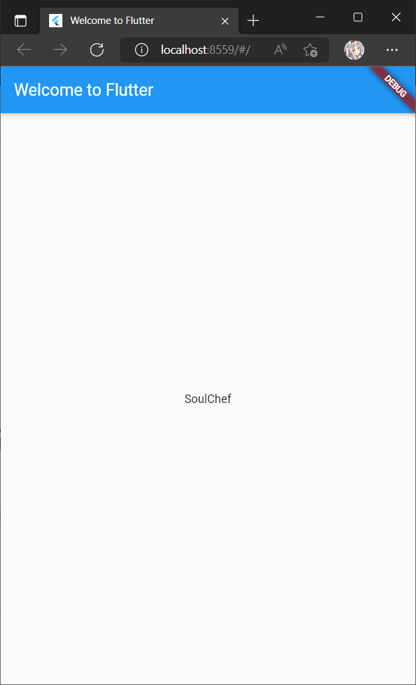
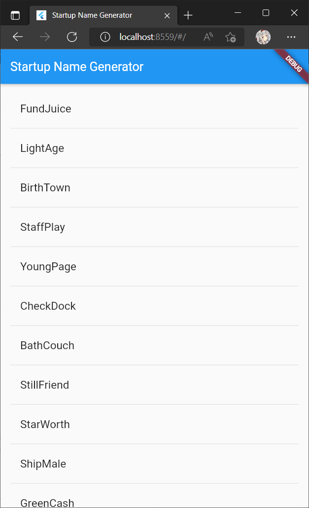
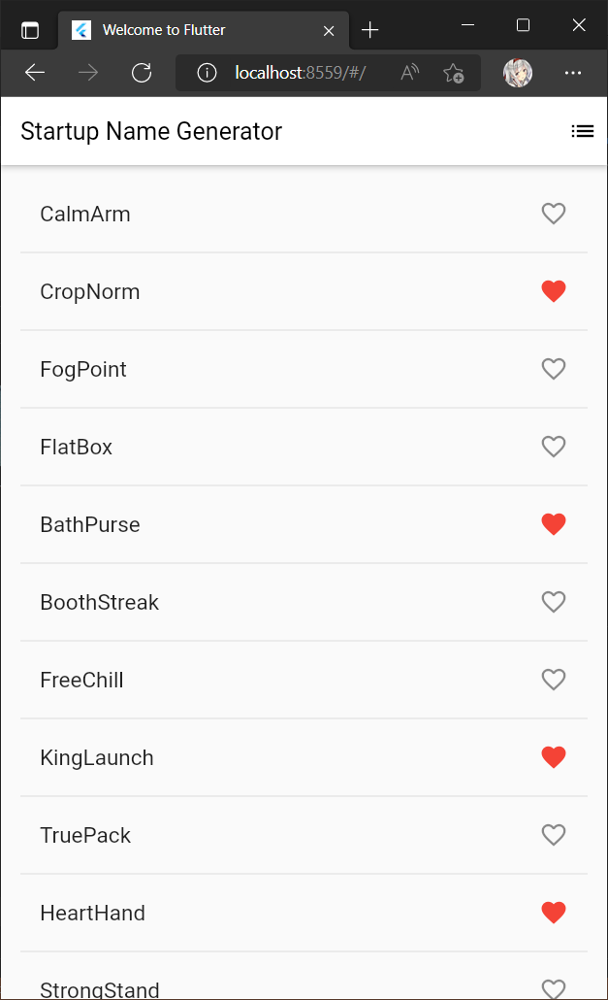
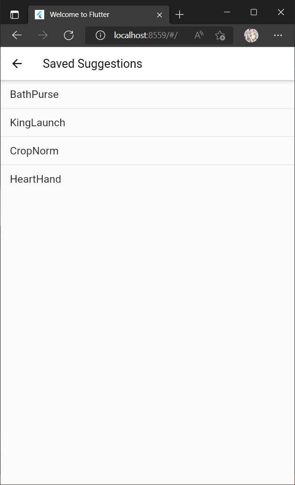

# startup_namer

A new Flutter project.

## Membuat project baru

Membuat project Flutter baru dengan nama startup_namer.

    $ flutter create startup_namer
    $ cd startup_namer
    
## Menambahkan paket baru di pubspec.yaml

Menambahkan paket *english_words* dari website pub.dev

    $ flutter pub add english_words
    Resolving dependencies...
      async 2.8.1 (2.8.2 available)
      characters 1.1.0 (1.2.0 available)
    + english_words 4.0.0
      matcher 0.12.10 (0.12.11 available)
      test_api 0.4.2 (0.4.5 available)
      vector_math 2.1.0 (2.1.1 available)
    Changed 1 dependency!
    
Mengimpor paket english_words ke dalam main.dart

    import 'package:english_words/english_words.dart';
    import 'package:flutter/material.dart';

    void main() {
      runApp(const MyApp());
    }

    class MyApp extends StatelessWidget {
      const MyApp({super.key});

    ...
    
## Menambahkan stateful widget

Menambahkan class Stateful Widget dengan nama RandomWords.

    class RandomWords extends StatefulWidget {
      const RandomWords({Key? key}) : super(key: key);

      @override
      State<RandomWords> createState() => _RandomWordsState();
    }

    class _RandomWordsState extends State<RandomWords> {
      @override
      Widget build(BuildContext context) {
        final wordPair = WordPair.random();
        return Text(wordPair.asPascalCase);
      }
    }

## Membuat listview infinite scrolling

- Menambahkan variabel pada class state dari class _RandomWordState

Variabel _suggestions digunakan untuk menyimpan, variabel _biggerFont digunakan mengatur gaya teks yang akan ditampilkan

      class _RandomWordsState extends State<RandomWords> {
        final _suggestions = <WordPair>[];                 // NEW
        final _biggerFont = const TextStyle(fontSize: 18); // NEW
        ...
      }

- Memperbarui method build dari class _RandomWordState

Mengganti widget menjadi ListView builder untuk menampilkan kata dalam daftar. Setiap kata ditampilkan dalam widget ListTile di dalam properti itemBuilder yang menerima 2 parameter, parameter terdiri dari BuildContext dan posisi atau index.

      @override
        Widget build(BuildContext context) {
          return ListView.builder(
            padding: const EdgeInsets.all(16.0),
            itemBuilder: (context, i) {
              if (i.isOdd) return const Divider();

              final index = i ~/ 2;
              if (index >= _suggestions.length) {
                _suggestions.addAll(generateWordPairs().take(10));
              }
              return ListTile(
                title: Text(
                  _suggestions[index].asPascalCase,
                  style: _biggerFont,
                ),
              );
            },
          );
        }

- Memperbarui main.dart

Memanggil class RandomWords di class MyApp

       @override
        Widget build(BuildContext context) {
          return MaterialApp(
            title: 'Startup Name Generator',
            home: Scaffold(
              appBar: AppBar(
                title: const Text('Startup Name Generator'),
              ),
              body: const Center(
                child: RandomWords(),
              ),
            ),
          );
        }

## Hasil akhir codelab bagian 1

| Single Text                                      | Listview Text                                    |
| ------------------------------------------------ | ------------------------------------------------ |
|  |  |                       |

## Hasil akhir codelab bagian 2

| Single Text                                      | Listview Text                                    |
| ------------------------------------------------ | ------------------------------------------------ |
|  |  |                       |

